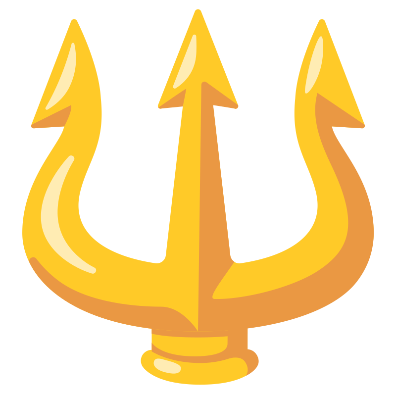

#  Poseidon

### **👁️ Overview**
Sea Monitoring System Web Application - 2022.

  Poseidon is a system utilizing machine learning models for monitoring and detecting illegal activities at sea. By leveraging advanced algorithms, Poseidon provides real-time analysis of maritime data to identify suspicious behavior, helping to combat illegal fishing, smuggling, and other illicit activities on the open waters. With Poseidon, authorities and organizations can enhance maritime security and protect marine ecosystems more effectively than ever before.

#

### **⚙️ Tech Stack**
- Frontend
  - .NET 6 - ASP.NET Core Blazor WebAssembly
  - Blazored - Local Storage | Modal | Toast
  - Radzen Blazor
  - Leaflet.js
  - MapBox
  - Bootstrap 5
- Backend
  - .NET 6 - ASP.NET Core Web API
  - ML.NET
  - ASP.NET Core Identity
  - Entity Framework Core
  - SignalR
  - Hangfire
- Database
  - Microsoft SQL Server

#

### **🛠️ Tools**
- Source Control: GitHub
- IDE: Rider | Visual Studio 2022
- API Client: Postman
- RDBMS: Azure Data Studio